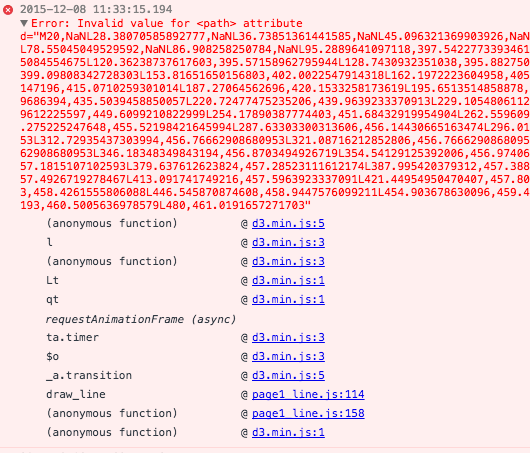
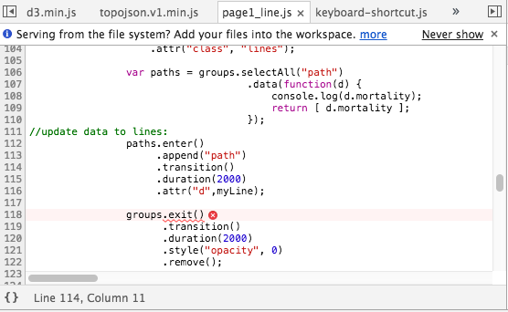

# Week 15: Project Help


## Debugging Reminders


### How to File a Bug Report

If you have a bug in your code, you need to do some things first, and then ask for help if you fail.  Your help request has to have details in it, or we will waste time!

* How do I recreate the problem you think you see?  For example: "click on the World button and there is an error in the console".
* Where in the code is the problem likely to be?  If you are doing your own good debugging effort, you have narrowed it down to a location in the code using breakpoints and the console.  Tell me what that says, and it will help me find it.
* Tell me what js file to look in.  You all have a zillion now.

### Breakpoints

Using breakpoints -- to stop your code at a certain line and inspect the values of various variables and data.

Use Command-option-i on the Mac to quickly open the console window. Click on the "SOURCE" tab. Navigate to the js file you are trying to debug.

Using breakpoints:

* https://developer.chrome.com/devtools/docs/javascript-debugging
* https://www.youtube.com/watch?v=CoESC2XGZLg, https://www.youtube.com/watch?v=L0aJDRdOYDo

Also, when you stop right before a certain point, you can then execute code "by hand" in the console window to see what the values are yourself.  I do this for selections (to see if there is anything actually selected) and scales - to check xScale.domain() for instance, to verify the numbers are right.

### Console.log()

Turn off excessive logging if you don't need it anymore!  You want your console.logs to be useful.  A linter will complain if there are ANY left when you finish your code.

### Use the Error Traceback

Click to expand the error message to see the lines of code, and find the first item FROM THE TOP that refers to your code (not d3 or another library you are including):



Then if you click on that line, your source window will take you there.  Notice in this case there is something else marked with a red X. This is also an error source.




## D3 Specific Debugging

### Tooltips

D3 tooltips Need to be attached to the document "body" to work properly!  Otherwise their positioning will be wrong.  Double check where you put them if you have location issues.

Also, use a class other than "tooltip" if you use Bootstrap.  It may conflict.

### NaN's in D3 code

Frequently, you get NaN's in the console with SVG shapes when there is something wrong with a scale.
Go back to how you set up your scales and check the .domain()s to see if they are valid.

### The Update Pattern

Remember there are some general patterns for the code for updated graphs.

1. Setup the svg and global variables first - like the scales.
2. Use the data to get the domains for your scales, probably in a draw function.
3. Draw the "initial view" of the graph.  If you are using an update, you can call the update function with your first data here.
3. The update function has 4 things in it to be general:
    a. **bind** the data to the dom elements (don't forget to use a key if you want good transitions):  ```var circles = svg.selectAll("circle.countries").data(mydata, function(d){return d.Country;});```
    b. **enter** to draw new ones
    c. **exit** to remove ones you don't need now
    d. **transition** - this applies to all the items "left" on the page after the enter and exit, and makes them move prettily.

You can see this full pattern in use in **[../Week8/scatter_data_update.html](../Week8/scatter_data_update.html)**.

### Data vs. Datum

If you have a single data element, you can use ```.datum()```. There is no enter function with a single data element!  You just append things after it.

If you want to create SVG elements from multiple data items, you need to use ```.data()``` and an enter() function.

Read the answer from Mike here: http://stackoverflow.com/questions/10086167/d3-how-to-deal-with-json-data-structures

TODO: Bring this forward into data binding, maybe the line section.


## Homework

Project work!


